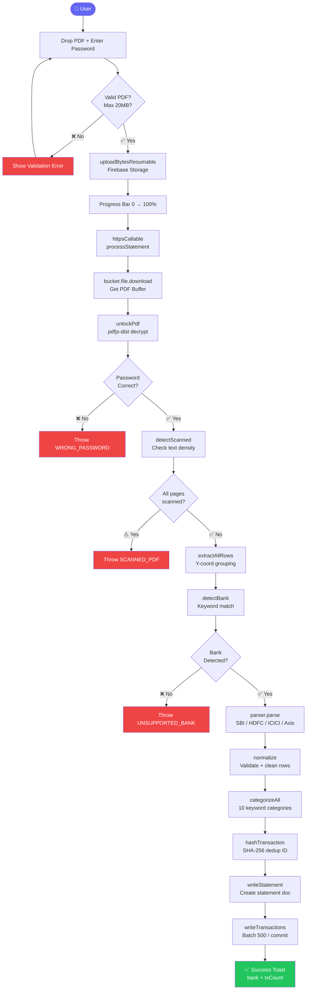
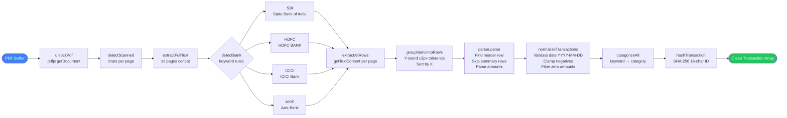
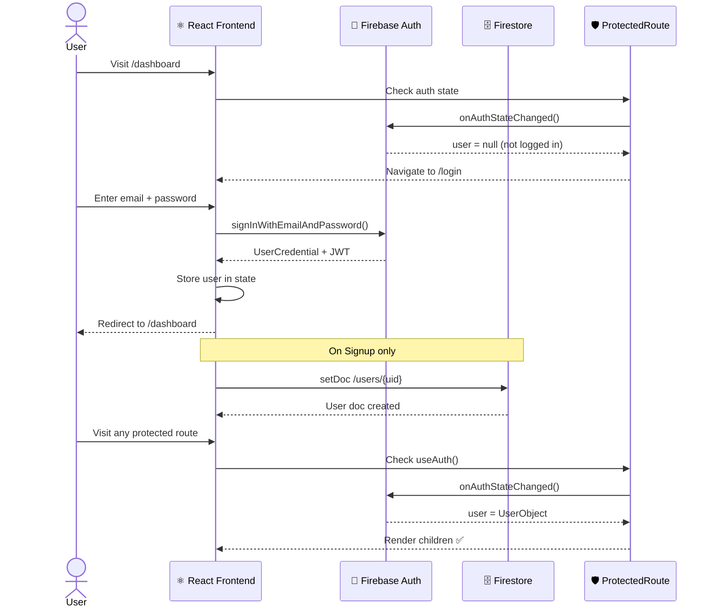
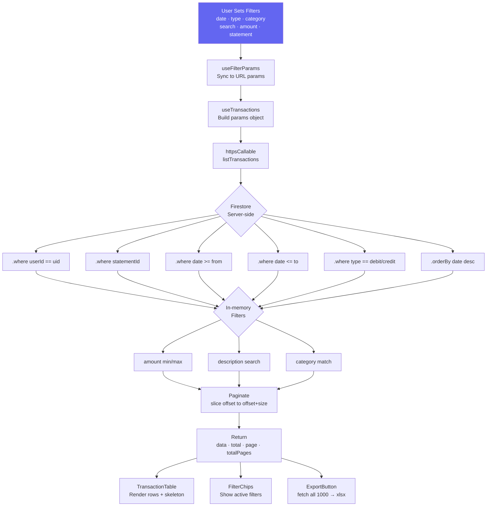
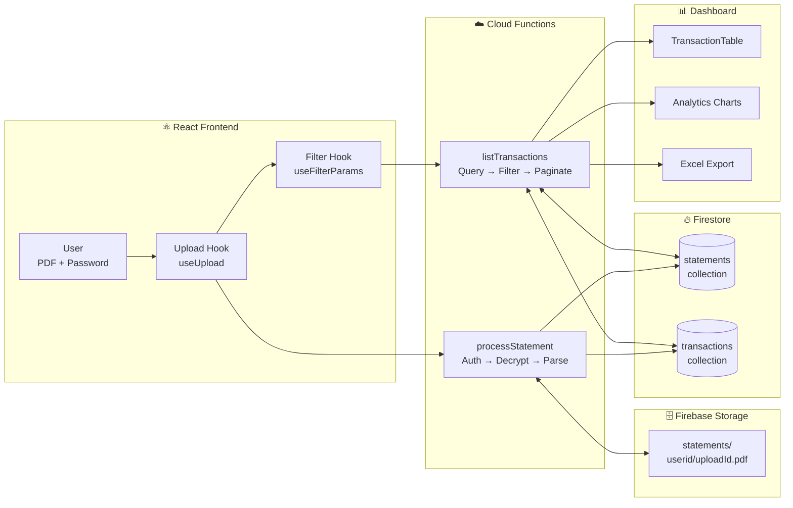

<div align="center">

# 🏦 Bank Statement Digitizer

### *Upload once. Filter forever. Export instantly.*

**BankDigitizer unlocks password-protected Indian bank PDFs, extracts every transaction, categorizes them automatically, and presents them in a filterable, exportable dashboard — fully serverless.**

<br/>

[](https://reactjs.org/)
[](https://vitejs.dev/)
[](https://tailwindcss.com/)
[](https://firebase.google.com)
[](https://nodejs.org)
[](https://vitest.dev)
[](https://github.com/Akshatsrii/bank-statement-digitizer)
[](#)

<br/>

[🧩 Problem](#-the-problem) · [💡 Solution](#-our-solution) · [✨ Features](#-features) · [🏗 Architecture](#-system-architecture) · [🔄 Flowcharts](#-core-workflows) · [🚀 Getting Started](#-getting-started) · [📁 Structure](#-project-structure) · [🗺 Roadmap](#-roadmap)

<br/>

> Upload a password-protected bank PDF → get clean, categorized, searchable transactions in seconds.

</div>

---

## 🧩 The Problem

Every Indian bank delivers your account statement as a **password-protected PDF** — a format that's completely impossible to search, filter, or use in any budgeting tool.

```bash
# What you get from your bank:
statement_jan_2024.pdf  ← password locked, unreadable by any tool

# What you actually need:
{ date, description, debit, credit, balance, category }[]
← structured, searchable, filterable, exportable
```

### 🔍 Root Problems We Identified

| Pain Point | Impact |
|:-----------|:-------|
| 🔐 **Password-protected PDFs** | No tool can read them without manual intervention |
| 🏦 **Different format per bank** | SBI, HDFC, ICICI all have unique column layouts |
| 📅 **Inconsistent date formats** | DD/MM/YYYY vs DD-MMM-YYYY vs DD-MM-YYYY |
| 🏷️ **No categorization** | Raw descriptions like "UPI-ZOMATO-123456" are unreadable |
| 📤 **No export options** | Stuck inside the bank's portal forever |
| 🔄 **Duplicate uploads** | Re-uploading the same statement creates duplicate records |

---

## 💡 Our Solution

**Bank Statement Digitizer** is a full-stack serverless application that handles the **entire pipeline** from encrypted PDF to clean data:

```
You upload a PDF + password
        ↓
Cloud Function unlocks it in-memory (password never stored)
        ↓
Layout-aware parser extracts every transaction row
        ↓
Auto-categorization: Salary / Food / Rent / Transport / ATM...
        ↓
SHA-256 deduplication — re-uploads are silently safe
        ↓
Firestore stores clean structured data, scoped to your account
        ↓
Filter · Search · Analyze · Export to Excel
```

> **No third-party OCR. No external APIs. Entirely within your Firebase project.**

---

## ✨ Features

<table>
<tr>
<td width="50%">

### 🔐 Password-Protected PDF Unlock
pdfjs-dist decrypts bank PDFs entirely in-memory inside the Cloud Function. The password travels over TLS and is immediately discarded — never logged, never stored.

</td>
<td width="50%">

### 🏦 Multi-Bank Parser Engine
Dedicated layout-aware parsers for SBI, HDFC, ICICI, and Axis Bank. Auto-detects which bank from the PDF text — no manual selection needed.

</td>
</tr>
<tr>
<td width="50%">

### 🏷️ Auto-Categorization
10 categories assigned automatically by keyword matching on the description: Salary, Food, Rent, Utility, Shopping, Transport, ATM, Investment, Health, Transfer.

</td>
<td width="50%">

### 🔑 SHA-256 Deduplication
Each transaction's Firestore document ID is a SHA-256 hash of userId + date + description + amount. Re-uploading the same statement is completely safe — no duplicates.

</td>
</tr>
<tr>
<td width="50%">

### 🔍 Powerful Filter System
Filter by date range, debit/credit type, category, amount range, and description search. All filters sync to URL — shareable and refresh-safe.

</td>
<td width="50%">

### 📊 Analytics Dashboard
Spend by category bar chart, monthly income vs expense line chart, top merchants, and auto-generated financial insights — all from real transaction data.

</td>
</tr>
<tr>
<td width="50%">

### 📤 Excel Export
Download all currently filtered transactions as a formatted `.xlsx` file via SheetJS — includes a summary sheet with totals and active filter metadata.

</td>
<td width="50%">

### 🌙 Dark / Light Mode
System preference detected on first load. Toggle persisted in localStorage. Full dark-first design with `#080a12` background and DM Mono typography.

</td>
</tr>
</table>

---

## 🏗 System Architecture

```
┌──────────────────────────────────────────────────────────────────────────┐
│                         CLIENT BROWSER                                   │
│                                                                          │
│   /login  /signup  /dashboard  /upload  /transactions                    │
│   /statements  /analytics  /profile                                      │
│                                                                          │
│   ┌───────────────────────────────────────────────────────────────────┐  │
│   │  React 18 + Vite + Tailwind v3 + react-router-dom v7             │  │
│   │                                                                   │  │
│   │  Pages              Components             Hooks                  │  │
│   │  • Dashboard        • Navbar               • useAuth              │  │
│   │  • Upload           • FilterBar            • useUpload            │  │
│   │  • Transactions     • FilterChips          • useTransactions      │  │
│   │  • Statements       • TransactionTable     • useFilterParams      │  │
│   │  • Analytics        • TransactionModal     • useTheme             │  │
│   │  • Profile          • ExportButton                                │  │
│   │  • Login/Signup     • StatementSelector                           │  │
│   └───────────────────────────────────────────────────────────────────┘  │
└─────────────────────────┬────────────────────────────────────────────────┘
                          │
                Firebase SDK v10
          httpsCallable · uploadBytesResumable
          onAuthStateChanged · Firestore SDK
                          │
┌─────────────────────────▼────────────────────────────────────────────────┐
│                   FIREBASE CLOUD FUNCTIONS  (Node 18)                    │
│                                                                          │
│   ┌─────────────────────┐    ┌──────────────────────────────────────┐   │
│   │  processStatement() │    │  listTransactions()                  │   │
│   │                     │    │                                      │   │
│   │  ① Auth check        │    │  ① Auth check                        │   │
│   │  ② Storage download  │    │  ② Firestore query                   │   │
│   │  ③ unlockPdf()       │    │     userId + statementId + date      │   │
│   │  ④ detectScanned()   │    │     type — server-side               │   │
│   │  ⑤ detectBank()      │    │  ③ Amount / search / category        │   │
│   │  ⑥ parser.parse()    │    │     — in-memory filter               │   │
│   │  ⑦ normalize()       │    │  ④ Paginate → return                 │   │
│   │  ⑧ categorize()      │    └──────────────────────────────────────┘   │
│   │  ⑨ hash + batch write│                                               │
│   └─────────────────────┘    ┌──────────────────────────────────────┐   │
│                               │  listStatements()                    │   │
│   Structured logging:         │  userId filter + uploadedAt sort     │   │
│   uploadId · userId(masked)   └──────────────────────────────────────┘   │
│   bank · txCount · errorType · durationMs                                │
└──────────────┬───────────────────────────────┬───────────────────────────┘
               │                               │
    ┌──────────▼──────────┐         ┌──────────▼──────────┐
    │   Firebase Storage  │         │   Cloud Firestore    │
    │                     │         │                      │
    │  statements/        │         │  /users/{uid}        │
    │    {uid}/           │         │  /statements/{id}    │
    │      {uploadId}.pdf │         │  /transactions/{hash}│
    └─────────────────────┘         └──────────────────────┘
```

---

## 🔄 Core Workflows

### 1️⃣ Upload & Parse Flow

> *What happens when a user uploads a bank PDF*



---

### 2️⃣ Parser Pipeline — Internal Flow

> *How raw PDF bytes become clean structured transactions*



---

### 3️⃣ Firebase Auth Flow

> *How secure login and route protection works*



---

### 4️⃣ Filter & Query Flow

> *How the transaction filter system works end-to-end*



---

### 5️⃣ End-to-End Data Flow

> *Complete journey of data through the BankDigitizer system*



---

## 📐 Unified Transaction Schema

Every bank's raw rows get normalized to this single shape:

```json
{
  "transactionId": "a1b2c3d4e5f6a7b8",
  "statementId":   "firestore-auto-id",
  "userId":        "firebase-auth-uid",
  "date":          "2024-01-15",
  "description":   "UPI-ZOMATO-Food delivery",
  "debit":         450.00,
  "credit":        0,
  "balance":       38050.00,
  "type":          "debit",
  "category":      "Food",
  "createdAt":     "Firestore Timestamp"
}
```

### Date Normalization Table

| Bank | Source Format | Example | Normalized |
|------|:-------------|---------|-----------|
| SBI | DD/MM/YYYY | 15/01/2024 | 2024-01-15 |
| HDFC | DD-MMM-YYYY | 15-Jan-2024 | 2024-01-15 |
| HDFC | DD/MM/YY | 15/01/24 | 2024-01-15 |
| ICICI | DD-MMM-YYYY | 15-Jan-2024 | 2024-01-15 |
| Axis | DD-MM-YYYY | 15-01-2024 | 2024-01-15 |

---

## 🗄 Firestore Data Model

```
firestore-root/
│
├── users/{uid}
│     ├── uid          : string
│     ├── email        : string
│     └── createdAt    : timestamp
│
├── statements/{statementId}
│     ├── statementId      : string  (= doc ID)
│     ├── userId           : string
│     ├── bankName         : SBI | HDFC | ICICI | AXIS
│     ├── fileName         : string
│     ├── storagePath      : string
│     ├── transactionCount : number
│     ├── uploadedAt       : timestamp
│     └── status           : pending | processing | done
│
└── transactions/{hash}   ← SHA-256(userId+date+description+amount)
      ├── transactionId : string   (= doc ID)
      ├── statementId   : string
      ├── userId        : string
      ├── date          : string   (YYYY-MM-DD)
      ├── description   : string
      ├── debit         : number
      ├── credit        : number
      ├── balance       : number
      ├── type          : debit | credit
      ├── category      : Salary|Food|Rent|Utility|Shopping|
      │                   Transport|ATM|Investment|Health|Transfer|Other
      └── createdAt     : timestamp
```

### Composite Indexes

```
transactions: userId ASC  + date DESC
transactions: userId ASC  + type ASC      + date DESC
transactions: userId ASC  + statementId ASC + date DESC
statements:   userId ASC  + uploadedAt DESC
```

---

## 🔒 Security Model

### Firestore Rules

```
✅ /users/{uid}          → read/write only if auth.uid == uid
✅ /statements/{id}      → read/write only if .userId == auth.uid
✅ /transactions/{hash}  → read/write only if .userId == auth.uid
❌ Cross-user access      → denied at rule level, not app level
❌ Unauthenticated        → denied
```

### Storage Rules

```
✅ statements/{uid}/**   → read/write only if auth.uid == uid
❌ Other user paths       → denied
```

### Password Handling

```
Browser ──(HTTPS/TLS)──▶ Cloud Function RAM ──▶ pdfjs-dist ──▶ discarded

❌ Never written to Cloud Logging
❌ Never stored in Firestore
❌ Never saved to Firebase Storage
❌ Never in function response body
```

---

## ⚙️ Tech Stack

### 🎨 Frontend

| Technology | Version | Purpose |
|:-----------|:--------|:--------|
| **React.js** | 18.x | Component-based UI with hooks |
| **Vite** | 5.x | Fast HMR dev server + bundler |
| **Tailwind CSS** | 3.x | Utility-first dark-first styling |
| **react-router-dom** | v7 | SPA routing + ProtectedRoute |
| **lucide-react** | 0.383 | Tree-shakeable SVG icon set |
| **xlsx (SheetJS)** | — | Client-side .xlsx generation |
| **recharts** | — | Bar + line charts for Analytics |

### ⚙️ Backend

| Technology | Version | Purpose |
|:-----------|:--------|:--------|
| **Firebase Cloud Functions** | v2 | Serverless Node 18 backend |
| **Cloud Firestore** | — | Per-user document database |
| **Firebase Storage** | — | GCS-backed PDF file storage |
| **Firebase Auth** | — | Email/password authentication |
| **pdfjs-dist (legacy)** | 3.11 | In-memory PDF decrypt + extract |
| **crypto (built-in)** | — | SHA-256 deduplication hashing |

### 🧪 Testing

| Technology | Purpose |
|:-----------|:--------|
| **Vitest** | Unit tests for all 4 bank parsers |
| **Fixture files** | Row dump fixtures per bank format |
| **CLI test scripts** | testPdf · testParser · testUnlock |

---

## 📁 Project Structure

```
bank-statement-digitizer/
│
├── 📂 Admin/                            # React 18 frontend
│   └── 📂 src/
│       │
│       ├── 📂 pages/
│       │   ├── Login.jsx               # Email/password auth form
│       │   ├── Signup.jsx              # Account creation + Firestore user doc
│       │   ├── Dashboard.jsx           # Summary stats + recent 6 transactions
│       │   ├── Upload.jsx              # Drag-drop + password + progress bar
│       │   ├── Transactions.jsx        # Table + all filters + export button
│       │   ├── Statements.jsx          # All statements + bank badge + View btn
│       │   ├── Analytics.jsx           # Category bar + monthly line + insights
│       │   └── Profile.jsx             # Email · joined date · change password
│       │
│       ├── 📂 components/
│       │   ├── Navbar.jsx              # DM Mono design · clock · dark/light
│       │   ├── ProtectedRoute.jsx      # Auth guard → redirect /login
│       │   ├── FilterBar.jsx           # Date/amount/type/category/search
│       │   ├── FilterChips.jsx         # Active filter pills with X dismiss
│       │   ├── TransactionTable.jsx    # Sticky header · skeleton · pagination
│       │   ├── TransactionModal.jsx    # Row click → detail modal + copy btn
│       │   ├── StatementSelector.jsx   # Dropdown filter by statement
│       │   ├── ExportButton.jsx        # Fetch all filtered → .xlsx download
│       │   ├── Toast.jsx               # Success / error / info notifications
│       │   └── ProgressBar.jsx         # Upload → Process → Done stepper
│       │
│       ├── 📂 hooks/
│       │   ├── useAuth.js              # onAuthStateChanged wrapper
│       │   ├── useUpload.js            # Storage upload + function call
│       │   ├── useTransactions.js      # listTransactions + validation
│       │   ├── useFilterParams.js      # URL ↔ filter state sync
│       │   └── useTheme.js             # Dark/light toggle + localStorage
│       │
│       ├── 📂 routes/
│       │   └── AppRoutes.jsx           # All routes with ProtectedRoute
│       │
│       └── firebase.js                 # SDK init: auth · db · storage · fns
│
├── 📂 functions/                        # Firebase Cloud Functions
│   │
│   ├── 📂 parsers/
│   │   ├── index.js                    # parseStatement() dispatcher
│   │   ├── sbi.js                      # DD/MM/YYYY · Dr/Cr suffix
│   │   ├── hdfc.js                     # DD-MMM-YYYY · 7-col layout
│   │   ├── icici.js                    # S.No detection · DD-MMM-YYYY
│   │   └── axis.js                     # DD-MM-YYYY · Tran Date col
│   │
│   ├── 📂 utils/
│   │   ├── unlockPdf.js                # pdfjs decrypt + typed errors
│   │   ├── extractRows.js              # Y-coord grouping + raw dump
│   │   ├── detectBank.js               # Keyword rules → bank name
│   │   ├── detectScanned.js            # Text density per page check
│   │   ├── normalizeTransactions.js    # Validate + clean parser output
│   │   ├── categorize.js               # 10-category keyword matcher
│   │   ├── hashTransaction.js          # SHA-256 dedup ID generator
│   │   └── logger.js                   # Structured JSON Cloud Logging
│   │
│   ├── 📂 firestore/
│   │   ├── writeStatement.js           # Create statement doc → return ID
│   │   ├── writeTransactions.js        # Batch write 500/commit
│   │   ├── listTransactions.js         # Query + in-mem filters + paginate
│   │   └── listStatements.js           # userId filter + date sort
│   │
│   ├── 📂 tests/
│   │   ├── 📂 fixtures/                # PDF row dump fixtures
│   │   │   ├── sbi.fixture.js
│   │   │   ├── hdfc.fixture.js
│   │   │   ├── icici.fixture.js
│   │   │   └── axis.fixture.js
│   │   ├── sbi.test.js                 # 11 unit tests
│   │   ├── hdfc.test.js                # 7 unit tests
│   │   ├── icici.test.js               # 8 unit tests
│   │   ├── axis.test.js                # 7 unit tests
│   │   └── parseStatement.smoke.test.js
│   │
│   ├── index.js                        # Exports all callables
│   ├── testPdf.js                      # CLI: raw text per page
│   ├── testParser.js                   # CLI: full parse preview
│   ├── testUnlock.js                   # CLI: error path testing
│   └── vitest.config.js
│
├── 📂 docs/
│   ├── schema.md
│   ├── firestore-schema.md
│   └── samples.md
│
├── 📂 samples/                          # Test PDFs — NOT committed
│   └── .gitignore                       # *.pdf
│
├── firestore.rules
├── firestore.indexes.json
├── storage.rules
├── firebase.json
├── .firebaserc
├── .prettierrc
├── .eslintrc.js
└── README.md
```

---

## 🧪 Error Codes

| Code | Triggered By | User-Facing Message |
|:-----|:------------|:--------------------|
| `WRONG_PASSWORD` | pdfjs PasswordException | "Incorrect password. Please check and try again." |
| `CORRUPT_PDF` | pdfjs InvalidPDFException | "This file is not a valid PDF or is corrupted." |
| `EMPTY_PDF` | pdf.numPages === 0 | "PDF opened but contains no pages." |
| `UNSUPPORTED_BANK` | detectBank → UNKNOWN | "Supported: SBI, HDFC, ICICI, Axis Bank." |
| `SCANNED_PDF` | All pages image-only | "Scanned PDFs not supported in v1 — use net banking PDF." |
| `STORAGE_DOWNLOAD` | bucket.download() fails | "Could not find the uploaded PDF in storage." |

---

## 🚀 Getting Started

### Prerequisites

```bash
node --version     # must be 18+
npm --version      # must be 9+
npm install -g firebase-tools
firebase --version
```

### Installation

**Step 1 — Clone**

```bash
git clone https://github.com/Akshatsrii/bank-statement-digitizer.git
cd bank-statement-digitizer
```

**Step 2 — Install dependencies**

```bash
cd functions && npm install && cd ..
cd Admin    && npm install && cd ..
```

**Step 3 — Firebase config**

Open `Admin/src/firebase.js` and paste your config from:
**Firebase Console → Project Settings → Your Apps → Web App**

```js
const firebaseConfig = {
  apiKey:            "AIza...",
  authDomain:        "your-project.firebaseapp.com",
  projectId:         "your-project-id",
  storageBucket:     "your-project.appspot.com",
  messagingSenderId: "123456789",
  appId:             "1:123...:web:abc...",
};
```

Enable email/password auth:
**Firebase Console → Authentication → Sign-in method → Email/Password → Enable**

**Step 4 — Deploy Firestore rules + indexes**

```bash
firebase login
firebase use --add
firebase deploy --only firestore
firebase deploy --only firestore:indexes
firebase deploy --only storage
```

**Step 5 — Run locally**

```bash
# Terminal 1
firebase emulators:start
# → Emulator UI: http://localhost:4000

# Terminal 2
cd Admin && npm run dev
# → App: http://localhost:5173
```

**Step 6 — Deploy backend**

```bash
firebase deploy --only functions
```

---

## 🧪 Testing

### Unit tests

```bash
cd functions
npm test
# Runs 33 unit tests: sbi · hdfc · icici · axis parsers
```

### With coverage

```bash
npm test -- --coverage
```

### Smoke tests against real PDFs

```bash
SBI_PASSWORD=pass HDFC_PASSWORD=pass ICICI_PASSWORD=pass npm test
```

### CLI debug tools

```bash
cd functions

# Print raw PDF text per page
node testPdf.js ../samples/SBI.pdf

# Full parse with table preview
node testParser.js ../samples/SBI.pdf YOUR_PASSWORD

# Inspect raw PDF item layout (debug new bank)
node testParser.js ../samples/HDFC.pdf YOUR_PASSWORD --inspect

# Test error handling paths
node testUnlock.js ../samples/SBI.pdf YOUR_PASSWORD
```

---

## 📅 Build Timeline

```
╔═════════════════════════════════════════╗  ╔═════════════════════════════════════════╗
║  Phase 1 — Foundation  ✅ DONE          ║  ║  Phase 2 — Core Pipeline  ✅ DONE       ║
╠═════════════════════════════════════════╣  ╠═════════════════════════════════════════╣
║  ✅ Repo + Firebase init                 ║  ║  ✅ unlockPdf + typed errors             ║
║  ✅ React/Vite/Tailwind scaffold          ║  ║  ✅ extractRows Y-coord grouping         ║
║  ✅ Firestore schema + rules             ║  ║  ✅ detectBank keyword fingerprint        ║
║  ✅ pdfjs-dist prototype                 ║  ║  ✅ detectScanned page density check      ║
╚═════════════════════════════════════════╝  ╚═════════════════════════════════════════╝

╔═════════════════════════════════════════╗  ╔═════════════════════════════════════════╗
║  Phase 3 — Parsers  ✅ DONE             ║  ║  Phase 4 — Firestore  ✅ DONE           ║
╠═════════════════════════════════════════╣  ╠═════════════════════════════════════════╣
║  ✅ SBI parser (DD/MM/YYYY)              ║  ║  ✅ writeStatement doc                   ║
║  ✅ HDFC parser (DD-MMM-YYYY)            ║  ║  ✅ writeTransactions 500-batch          ║
║  ✅ ICICI parser (S.No detection)        ║  ║  ✅ SHA-256 deduplication                ║
║  ✅ Axis parser (DD-MM-YYYY)             ║  ║  ✅ listTransactions + filters           ║
╚═════════════════════════════════════════╝  ╚═════════════════════════════════════════╝

╔═════════════════════════════════════════╗  ╔═════════════════════════════════════════╗
║  Phase 5 — UI  ✅ DONE                  ║  ║  Phase 6 — Auth + Polish  ✅ DONE       ║
╠═════════════════════════════════════════╣  ╠═════════════════════════════════════════╣
║  ✅ Upload page drag-drop + progress     ║  ║  ✅ Firebase Auth email/password         ║
║  ✅ Transactions table + skeleton        ║  ║  ✅ Login · Signup · ProtectedRoute      ║
║  ✅ Filters + URL sync + chips           ║  ║  ✅ Dashboard · Analytics · Profile      ║
║  ✅ Excel export + summary sheet         ║  ║  ✅ Dark/light mode · Transaction modal  ║
╚═════════════════════════════════════════╝  ╚═════════════════════════════════════════╝
```

---

## 🗺 Roadmap

```
╔══════════════════════════════════════╗   ╔══════════════════════════════════════╗
║   v1.0.0 — MVP  ✅ RELEASED          ║   ║   v2.0.0 — Intelligence  🔲           ║
╠══════════════════════════════════════╣   ╠══════════════════════════════════════╣
║  ✅ 4-bank PDF parser engine          ║   ║  🔲 OCR support (Tesseract.js)        ║
║  ✅ Firebase Auth + Firestore         ║   ║  🔲 AI categorization (Gemini API)    ║
║  ✅ Analytics dashboard               ║   ║  🔲 Budget goals + alerts             ║
║  ✅ Excel export                      ║   ║  🔲 Google OAuth sign-in              ║
║  ✅ 33 unit tests                     ║   ║  🔲 Bank of Baroda + Kotak parsers    ║
╚══════════════════════════════════════╝   ╚══════════════════════════════════════╝

╔══════════════════════════════════════╗   ╔══════════════════════════════════════╗
║   v3.0.0 — Scale  🔲                 ║   ║   v4.0.0 — Mobile  🔲                ║
╠══════════════════════════════════════╣   ╠══════════════════════════════════════╣
║  🔲 Multi-account support             ║   ║  🔲 React Native app                  ║
║  🔲 Webhook: auto-scan on email       ║   ║  🔲 Camera PDF scan                   ║
║  🔲 Google Sheets export              ║   ║  🔲 VS Code extension                 ║
╚══════════════════════════════════════╝   ╚══════════════════════════════════════╝
```

---

## ⚠️ Known Limitations

| Issue | Workaround / Status |
|:------|:-------------------|
| Scanned PDFs (image-only) | Warns user — OCR planned for v2 |
| HDFC credit card statements | Only savings account format supported in v1 |
| Axis NRI statement format | Non-standard column layout — v2 |
| Statements with 1000+ rows | First parse is slow — batch writes optimize storage |
| Multi-page statements with unusual fonts | Use `--inspect` flag in testParser.js to debug |

---

<div align="center">

Built in a 10-day sprint &nbsp;·&nbsp; Firebase + React + pdfjs-dist

**[Akshat Srivastava](https://github.com/Akshatsrii)**

[](https://github.com/Akshatsrii)
[](https://protfolio-531z.vercel.app)


&nbsp;


⭐ **Star this repo if BankDigitizer saved you from PDF hell!** ⭐

*Upload once. Filter forever. Export instantly.*

</div>
